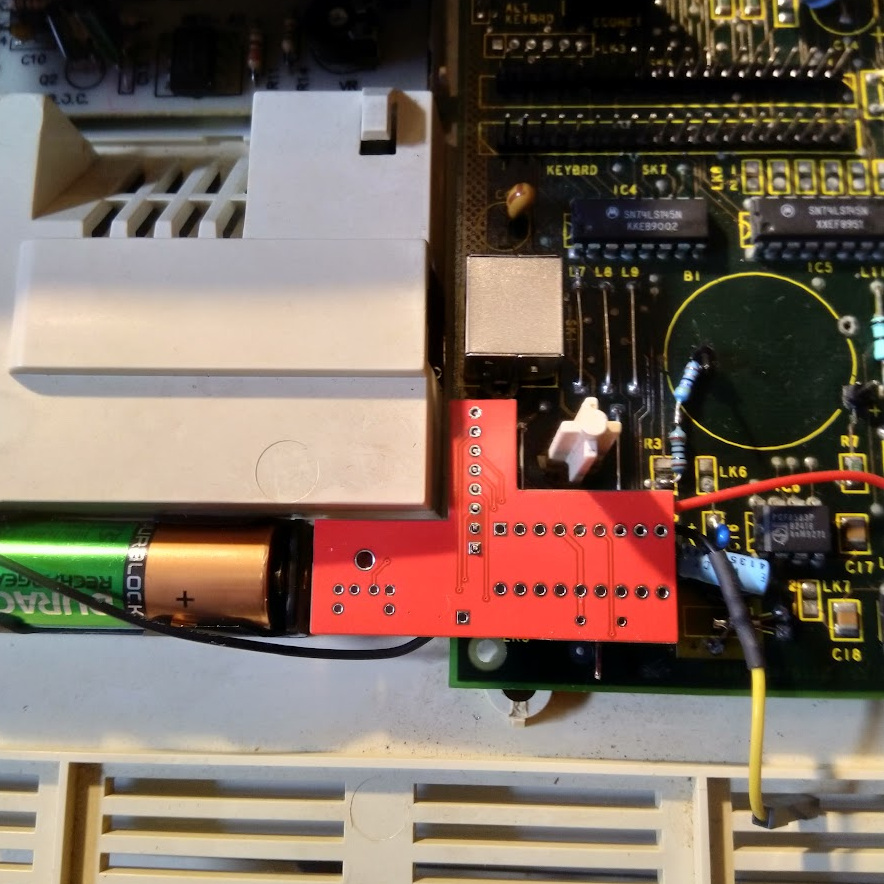

# A3000 PS/2 Mouse Adapter

A simple adapter PCB that fits internally to the Aux Mouse pins on the Acorn A3000 to provide a PS/2 Mouse port using a PIC 16F627A-I/P microcontroller.

It was based on [Henryk Richter's Amiga PS/2 Mouse Adapter](http://bax.comlab.uni-rostock.de/en/hardware/ps2-amiga-maus/), which is based on [Denis Sotchenko's](http://ps2m.sotchenko.ru/index.html) 'ps2m' project.

It's to be fitted upside down and if a new hole is cut in to the underside of the case it *should* be able to allow a PS/2 mouse to be connected whilst not affecting the original A3000 mouse port. I have not tried this as my friend did not want their A3000 case modified, I ran a cable out of the back of the machine with a PS/2 socket inline on it intead, not the neatest, but it worked.

Board designs were done in EasyEDA, gerbers are available. Only parts required are the PIC16F627A-I/P, a 10nF bypass cap, a PS/2 port and some header pins, male & female.

Good luck!